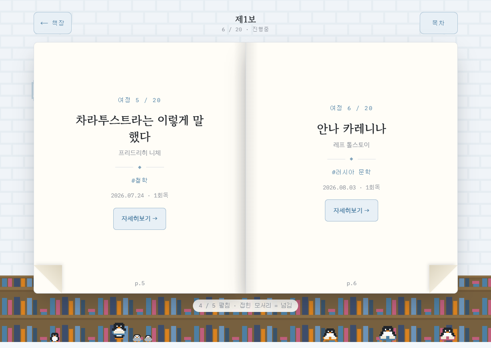
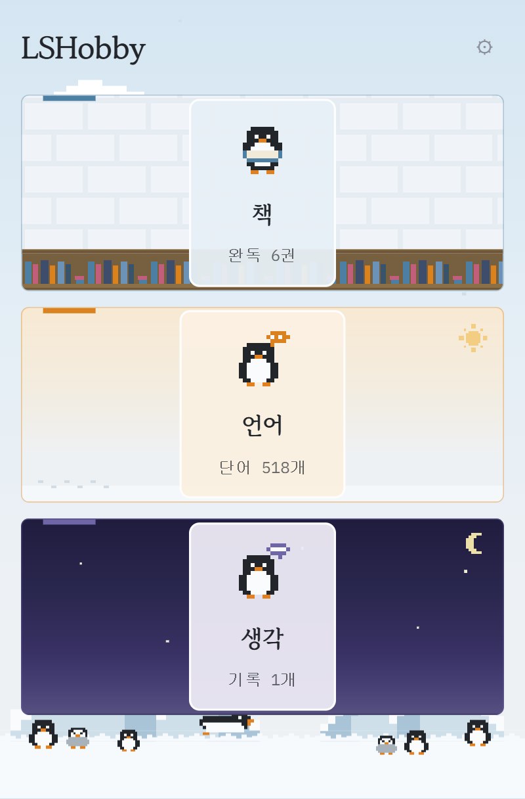
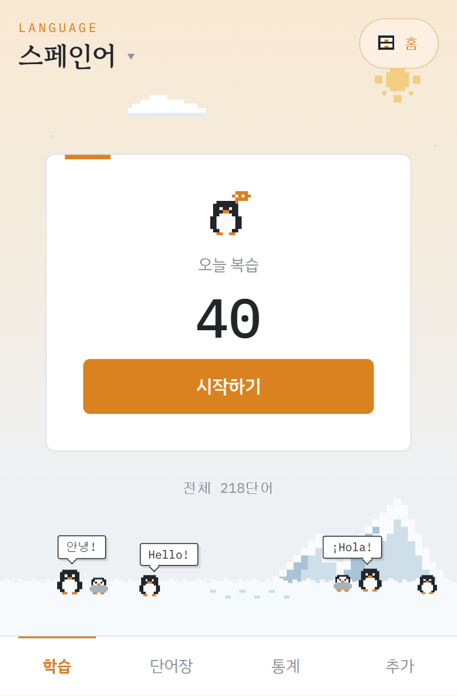

# LSHobby

개인 지식·취미 관리 웹앱 — 책 · 언어 · 생각 세 서랍을 한곳에서 (네 번째 서랍 CV는 [별도 리포](https://github.com/LeeSongHeon-LSH/LeeSongHeon-LSH.github.io)로 나갔다). 핵심 가치는 **"시간에 따라 생각이 변하는 과정"의 기록**(reflection).

- **프로덕션**: `https://<호스트>.ts.net:8443` — 이 집 PC가 상시 호스팅, **테일넷 안에서만** 열린다. 실제 주소는 공개할 이유가 없어 적지 않는다(`tailscale serve status`로 확인) ([docs/16 §16.5](docs/16-infra.md))
- **스택**: Next.js + Tailwind + Supabase, 호스팅은 집 PC + Tailscale — 근거는 [docs/02](docs/02-tech-stack.md)
- **설계 문서**: [docs/](docs/README.md) — 아키텍처·모듈 설계·ERD/DDL·요구사항 명세(SRS)·인프라 해설(§16)

## 화면



**책** — 서재에서 책등을 고르면 지면이 펼쳐지고, 접힌 모서리를 누르면 넘어간다. 벽·책장·펭귄은 세 서랍이 함께 쓰는 한 장면이고, 화면은 그 앞에 놓인다.

| 홈 — 세 서랍 | 언어 — 오늘 복습 |
| :---: | :---: |
|  |  |

## 개발

```bash
npm install
npm run dev     # localhost:3000 (.env 필요 — docs/16 §16.4)
npm test        # vitest
```

배포는 **`main` 푸시**다 — 이 PC의 systemd 타이머(`lshobby-deploy.timer`)가 2분마다 origin/main을 확인해 받아서 빌드·재시작한다. 작업 트리가 더럽거나 빌드가 실패하면 건드리지 않는다 ([docs/16 §16.5](docs/16-infra.md), 로그는 `journalctl --user -u lshobby-deploy`). 기다리지 않고 바로 올리려면:

```bash
npm run build && systemctl --user restart lshobby
```

DB 스키마 변경은 `supabase/migrations/`가 원본 — 절차는 [docs/16 §16.6](docs/16-infra.md).

## 로컬 LLM

생각 세션의 하루 요약(집 PC cron 00:30)은 **로컬 Ollama**(`localhost:11434`)로만 돈다 — 생각 데이터는 외부 API로 보내지 않는다는 정책 때문이다. 구성은 [docs/16 §16.11](docs/16-infra.md).

## 활동 미러

홈 타임라인의 원천인 `activity_feed`는 매일 00:40 집 PC cron이 **Notion DB로 단방향 복제**한다 — 생각 도메인은 위 정책에 따라 제외. 구성과 운영은 [docs/16 §16.12](docs/16-infra.md).

## 공개 CV

이력서는 [`LeeSongHeon-LSH.github.io`](https://github.com/LeeSongHeon-LSH/LeeSongHeon-LSH.github.io) 리포의 `cv.md`가 원본이고 GitHub Pages(https://leesongheon-lsh.github.io)로 나간다 — 이 앱에는 더 이상 CV 코드도 테이블도, 홈에서 나가는 링크도 없다(#69). 경위는 [docs/17](docs/17-cv.md).

> 구 스페인어 학습 앱(FastAPI + SQLite)은 2026-08-15 컷오버로 종료·삭제됨 (git 히스토리에 보존, `spanish.db` 백업은 홈 디렉터리).
