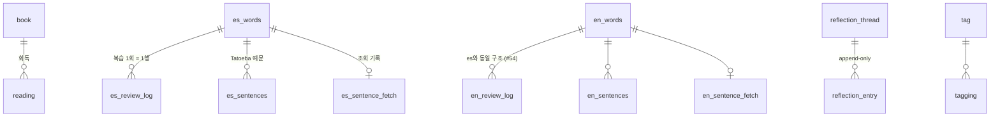

> LSHobby 설계 문서 — 목차·로드맵·§번호↔파일 매핑은 [README](README.md) 참조

> **개정 (2026-08-20, 결정 #57~61 반영 완료)**: CS 세션 제거 · 인용구 삭제가 코드(커밋 6246582~)와 DB(마이그레이션 20260820090000 · 20260820100000)에 모두 반영됐다. 본문은 현행 상태로 개정됨 — CS/quote 관련 폐기 항목은 사료 표시.

## 9. 전체 ERD 및 DDL — 확정 (2026-08-14) · 개정 (2026-08-20, #57·#58)

컷오버 시 이 DDL이 Supabase 마이그레이션 파일의 원본이 된다.
2026-08-20 구조 개편으로 `quote`·`concept`·`concept_link` 3테이블과 CS 이미지용 `attachments` Storage 버킷을 drop — 현행 **16테이블**.
영어 확장(2026-08-18, #54)으로 `en_*` 4개 테이블이 추가됐다 — `es_*`와 동일 구조에서 `gender`(언어 특수 필드)만 제외.
이때 예문 원문 컬럼을 일반화했다: `es_sentences.es_text` → `text` (언어가 늘어도 스키마가 자연스럽도록).

### 9.1 ERD



FK 없는 다형 참조(그림에 없는 연결, §4.5):

- `reflection_thread(subject_type, subject_id)` ⇢ book · es_words
- `tagging(subject_type, subject_id)` ⇢ book
- `activity_feed(entity_type, entity_id)` ⇢ 전 도메인 (summary 비정규화라 원본 참조 자체가 불필요)

관계 없는 독립 테이블: `cv_document` (§17 — 1행 운용, FK·다형 참조 없음)

### 9.2 DDL

```sql
-- ============ shared ============

create table tag (
  id    bigint generated always as identity primary key,
  name  text not null unique
);

create table tagging (
  id           bigint generated always as identity primary key,
  tag_id       bigint not null references tag(id) on delete cascade,
  subject_type text not null,      -- 'book' (태그 대상이 늘면 값 추가)
  subject_id   bigint not null,    -- FK 없음: 다형 참조 (§4.5)
  unique (tag_id, subject_type, subject_id)
);
create index idx_tagging_subject on tagging (subject_type, subject_id);

create table reflection_thread (
  id           bigint generated always as identity primary key,
  subject_type text not null,      -- 'book' | 'es_word'
  subject_id   bigint not null,    -- FK 없음: 다형 참조
  created_at   timestamptz not null default now(),
  unique (subject_type, subject_id)   -- 엔티티당 스레드 1개
);

create table reflection_entry (
  id         bigint generated always as identity primary key,
  thread_id  bigint not null references reflection_thread(id) on delete cascade,
  content    text not null,
  context    text,                 -- 계기 메모 — 책은 'N회독' 자동 기입 (§7.2)
  created_at timestamptz not null default now()   -- 이 순서가 곧 타임라인
);
create index idx_reflection_entry_thread on reflection_entry (thread_id);

create table activity_feed (
  id          bigint generated always as identity primary key,
  domain      text not null,       -- 'library' | 'language' ('knowledge'는 과거 이벤트에만)
  entity_type text not null,       -- 'book' | 'es_word' | 'reflection' …
  entity_id   bigint not null,     -- FK 없음: 엔티티 삭제 후에도 이벤트는 남는다 (§9.3)
  action      text not null,       -- 'created' | 'updated' | 'reflected' | 'completed' …
  summary     text not null,       -- 타임라인 한 줄 (비정규화 — 홈은 이 테이블만 읽음)
  occurred_at timestamptz not null default now()
);
create index idx_activity_feed_occurred on activity_feed (occurred_at desc);

-- ============ library ============

create table book (
  id         bigint generated always as identity primary key,
  title      text not null,
  author     text not null,
  translator text,                 -- 옮긴이 (선택)
  publisher  text not null,
  pub_year   text not null,        -- 원저 발표연도. 텍스트 — 'BC 380' 같은 값 허용
  note       text,                 -- 책당 1개 마크다운 노트 (§7.1)
  created_at timestamptz not null default now()
);

create table reading (
  id          bigint generated always as identity primary key,
  book_id     bigint not null references book(id) on delete cascade,
  finished_on date not null default current_date,        -- 미입력 시 기록일
  rating      smallint check (rating between 1 and 5),   -- 선택 별점
  created_at  timestamptz not null default now()
);
create index idx_reading_book on reading (book_id);

-- quote는 #58(인용구 삭제), concept·concept_link는 #57(CS 제거)로 2026-08-20 drop —
-- 마이그레이션 20260820090000_drop_knowledge · 20260820100000_drop_quote 참조
-- 리뷰 집계 RPC 4종(es/en_word_stats · es/en_daily_stats)은 20260820120000 참조 (#62 — security invoker, RLS 적용)

-- ============ language (언어별 테이블 — es_* 원본, en_*은 동일 구조·gender 제외 #54) ============

create table es_words (
  id             bigint generated always as identity primary key,
  word           text not null,
  gender         text not null check (gender in ('m','f','n','none')),  -- 언어 특수 필드
  meaning        text not null,
  norm           text not null unique,   -- 악센트 관대·ñ 엄격 정규화 결과로 중복 차단 (§6.2)
  -- FSRS 상태: ts-fsrs Card 필드 그대로 (§6.3)
  due            timestamptz,
  stability      real,
  difficulty     real,
  elapsed_days   int not null default 0,
  scheduled_days int not null default 0,
  reps           int not null default 0,
  lapses         int not null default 0,
  learning_steps int not null default 0,       -- ts-fsrs 5.x 추가 필드 (2026-08-14 마이그레이션으로 반영)
  state          smallint not null default 0,  -- 0 New / 1 Learning / 2 Review / 3 Relearning
  last_review    timestamptz,
  created_at     timestamptz not null default now()
);
create index idx_es_words_due on es_words (due);

create table es_review_log (
  id          bigint generated always as identity primary key,
  word_id     bigint not null references es_words(id) on delete cascade,
  rating      smallint not null,   -- ts-fsrs Rating: 1 Again / 3 Good (자동 채점 이분 매핑)
  reviewed_at timestamptz not null default now()
);
create index idx_es_review_log_word on es_review_log (word_id);
create index idx_es_review_log_at   on es_review_log (reviewed_at);

create table es_sentences (
  id         bigint generated always as identity primary key,
  word_id    bigint not null references es_words(id) on delete cascade,
  text       text not null,       -- 해당 언어 원문 (구 es_text — #54에서 일반화)
  ko_text    text,
  en_text    text,                -- 원문이 영어인 언어에선 항상 null
  source_url text
);
create index idx_es_sentences_word on es_sentences (word_id);

create table es_sentence_fetch (
  word_id    bigint primary key references es_words(id) on delete cascade,
  fetched_at timestamptz not null default now()
);

-- en_words / en_review_log / en_sentences / en_sentence_fetch (#54):
-- 위 es_* 4테이블과 동일 구조·인덱스·RLS. 차이는 en_words에 gender 컬럼이 없는 것뿐 (§6.2)

-- ============ cv (§17) ============

create table cv_document (
  id         bigint generated always as identity primary key,
  content    text not null default '',   -- CV 전문 마크다운 (1행 운용)
  updated_at timestamptz not null default now()
);

-- ============ RLS: 전 테이블 "authenticated 전부 허용" ============
-- anon은 기본 거부(RLS 기본값), 로그인 = 본인 (1계정 전제 — §9.3)

do $$
declare t text;
begin
  for t in select tablename from pg_tables where schemaname = 'public' loop
    execute format('alter table %I enable row level security', t);
    execute format(
      'create policy authenticated_all on %I for all to authenticated using (true) with check (true)',
      t);
  end loop;
end $$;

-- §17: cv_document만 공개 읽기 허용 — 전 스키마에서 유일한 anon 정책 (#51, SEC-02 개정)
create policy anon_read_cv on cv_document for select to anon using (true);
```

### 9.3 DDL 수준 결정 사항

- **PK**: 전 테이블 `bigint generated always as identity`. uuid 기각 — 분산·오프라인 생성이 없는 1인 서버 생성 구조에서 정수가 모든 면에서 가벼움
- **RLS**: 켜되 정책은 "authenticated 전부 허용", **`user_id` 컬럼 없음** — 계정이 본인 하나뿐이라 "로그인함 = 본인". 다중 사용자로 확장하면 그때 컬럼 추가 마이그레이션. Storage는 미사용(CS 이미지용 attachments 버킷은 #57로 삭제). **예외**: `cv_document`만 anon SELECT 허용 — 공개 CV (§17, #51)
- **다형 참조 값 규칙**: `subject_type`/`entity_type`은 테이블을 특정하는 값(`'es_word'`, 영어 추가 시 `'en_word'`) — §4.4 초안의 `'vocab'` 정정. 컬럼 하나로 대상 테이블까지 식별
- **학습 카운터 컬럼 없음**: 현행 앱의 `test_count`/`correct_count` 이중 저장을 제거 — 통계·스트릭·하루 신규 20개 한도·어려운 단어 판정 전부 `es_review_log`에서 파생 집계
- **cascade 이원화**: 진짜 FK는 DB `on delete cascade`, 다형 참조 행(reflection·tagging)은 앱 레이어가 삭제 (§4.5 "무결성은 앱 레이어" 결정의 귀결. 트리거는 숨은 로직이 되기 쉬워 배제)
- **activity_feed 영구 보존**: 엔티티를 삭제해도 과거 이벤트는 타임라인에 남김 — 일어난 역사이고 `summary` 비정규화라 표시에 원본이 필요 없음. 원본 없는 이벤트는 UI에서 링크 비활성 처리
- **시간 타입**: 시각은 `timestamptz`, 하루 단위 사실(완독일)은 `date`

