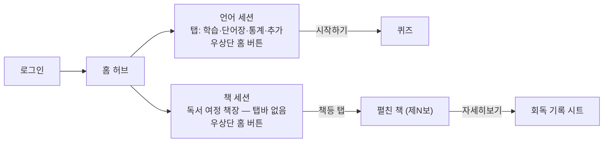
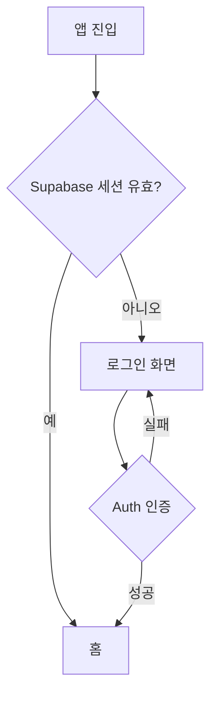
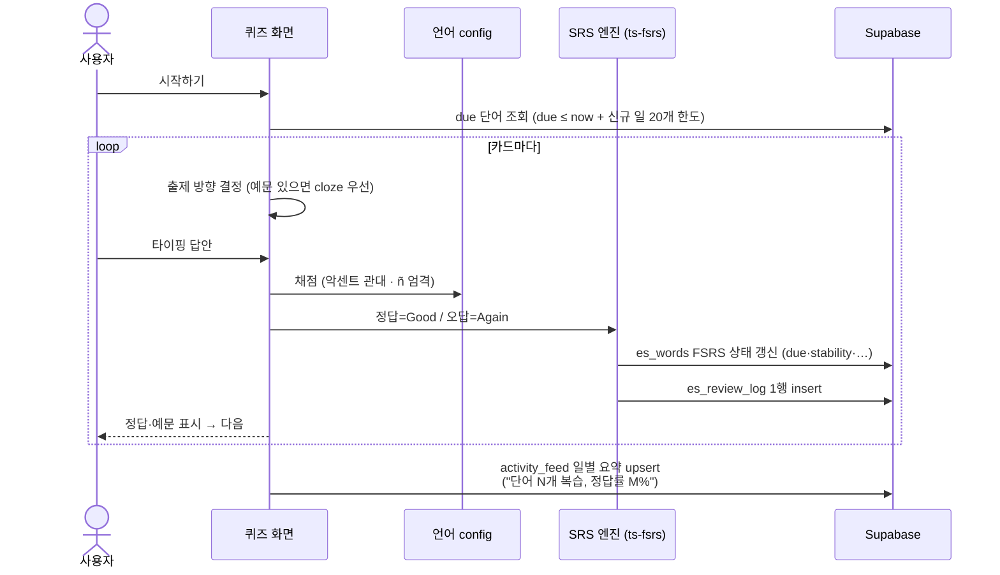
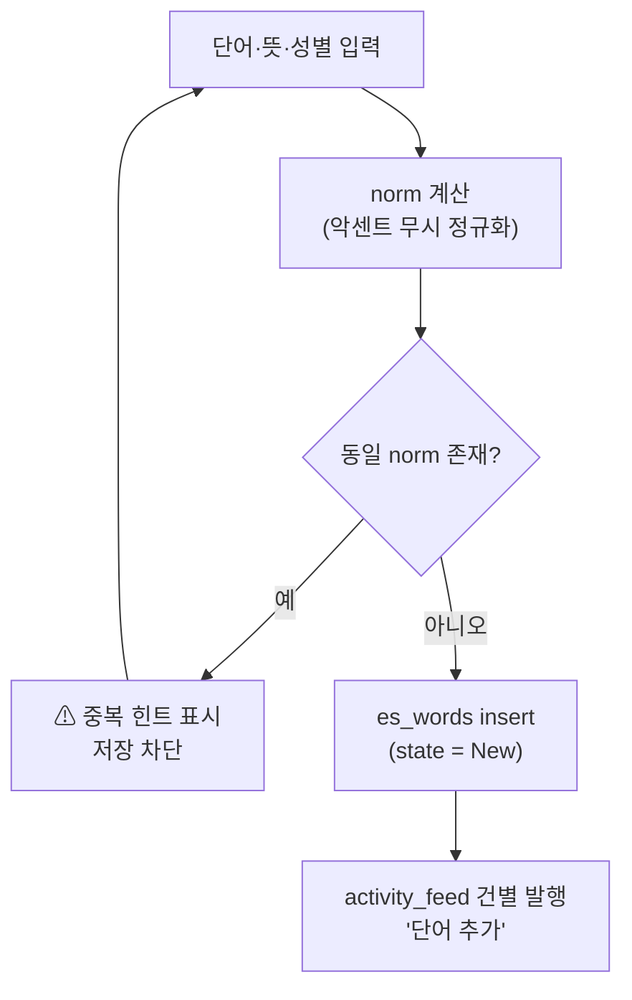
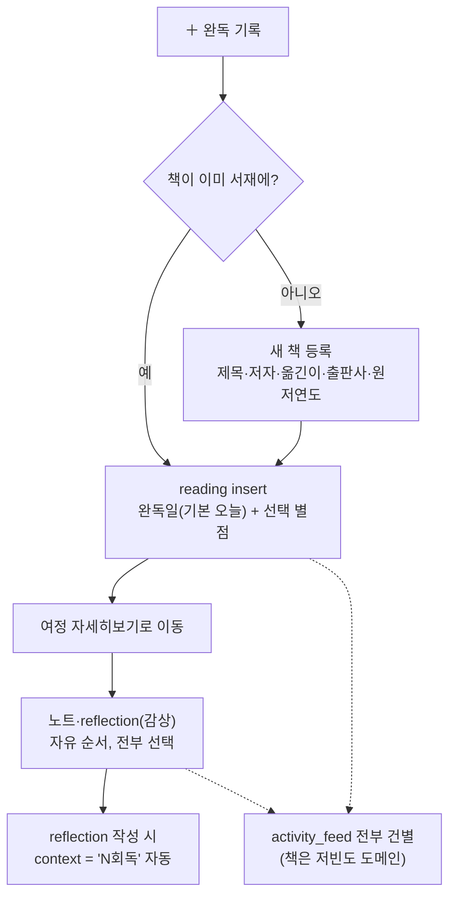
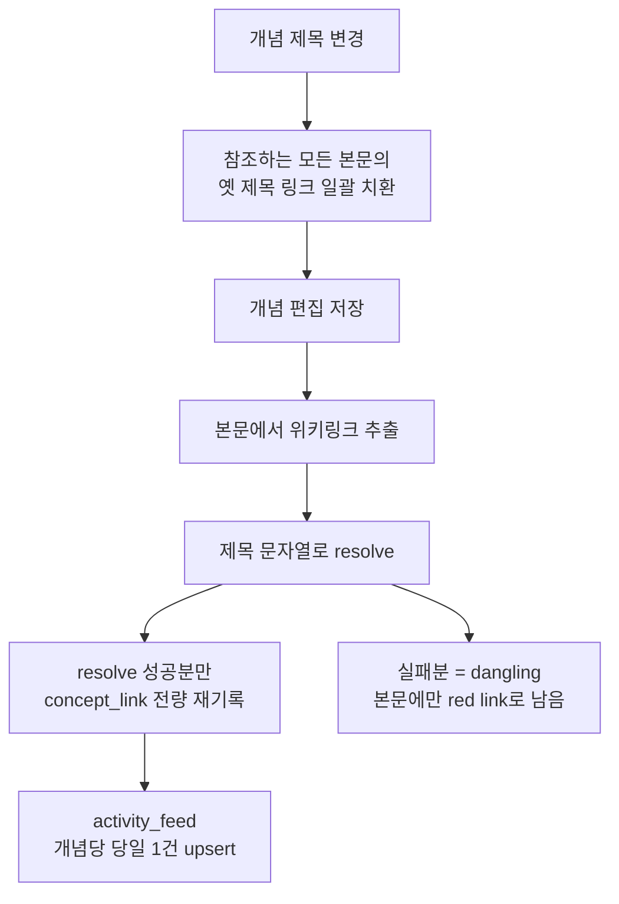
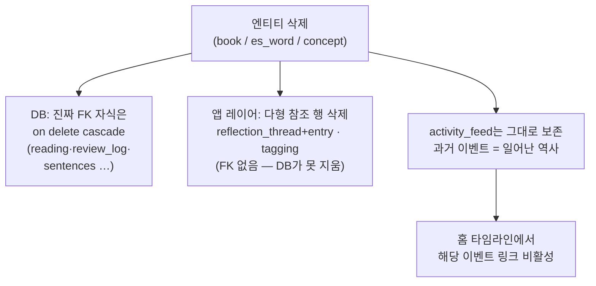

> LSHobby 설계 문서 — 목차·로드맵·§번호↔파일 매핑은 [README](README.md) 참조

> **개정 (2026-08-20, 결정 #57~59)**: CS 세션 제거 · 인용구 삭제 · 책 세션 = 독서 여정 책장(탭바 없음) · 탭바 [홈] 슬롯 폐지 — 14.1·14.5·14.7 반영, 14.6은 사료.

## 14. 흐름도 (Flow Diagram) — 확정 (2026-08-14)

주요 사용자 흐름과 데이터 흐름을 mermaid로 고정한다. 화면 요소의 원본은 §11, 규칙의 원본은 §12 — 여기서는 **분기와 부수효과(어느 테이블이 언제 쓰이는가)**를 드러내는 것이 목적이다.

### 14.1 전체 내비게이션 맵

- 세션 간 직접 이동 없음 — 항상 홈 경유(우상단 홈 버튼, #59). 상세·편집은 푸시 화면
- 홈 타임라인은 #53에서 제거 — activity_feed 발행 규약은 유지(§5.3)

### 14.2 인증

- 회원가입·비밀번호 찾기 경로 없음 — 가입은 서버에서 차단(SEC-01), 분실 복구는 앱 밖 런북(SEC-08)

### 14.3 복습 퀴즈 (핵심 루프)

- **복습 1회 = `es_review_log` 1행**이 유일한 이력 원본 — 통계·스트릭·어려운 단어·신규 한도 전부 여기서 파생(#36)
- activity는 당일 재학습 시 같은 행을 **갱신**(건별 발행 아님, §6.4)

### 14.4 단어 추가

### 14.5 책 완독 기록 (§7.2)

- 중간 기록 없음 — 완독 전의 책을 앱은 모른다(§7.4, 의도된 트레이드오프)

### 14.6 개념 저장·제목 변경 — **폐기 (2026-08-20, #57)**

- `concept_link`는 저장 시마다 **전량 재기록**이라 증분 버그가 원리적으로 없음(§8.2)
- 개념 생성·reflection은 건별 발행, 본문 수정만 당일 1건(§8.4)

### 14.7 엔티티 삭제 — cascade 이원화 (§9.3, 유지보수 핵심 불변식)

- **삭제 구현 시 반드시 두 갈래(B+C)를 모두 수행**해야 한다. C를 빠뜨리면 고아 reflection/tagging이 남는다 — 무결성은 앱 레이어 책임(§4.5)
