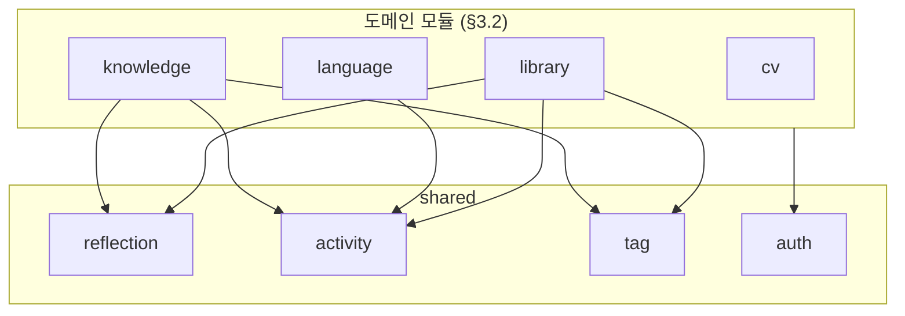
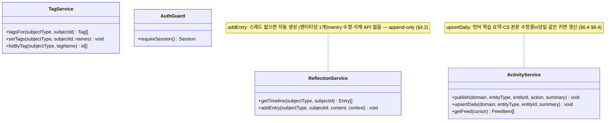
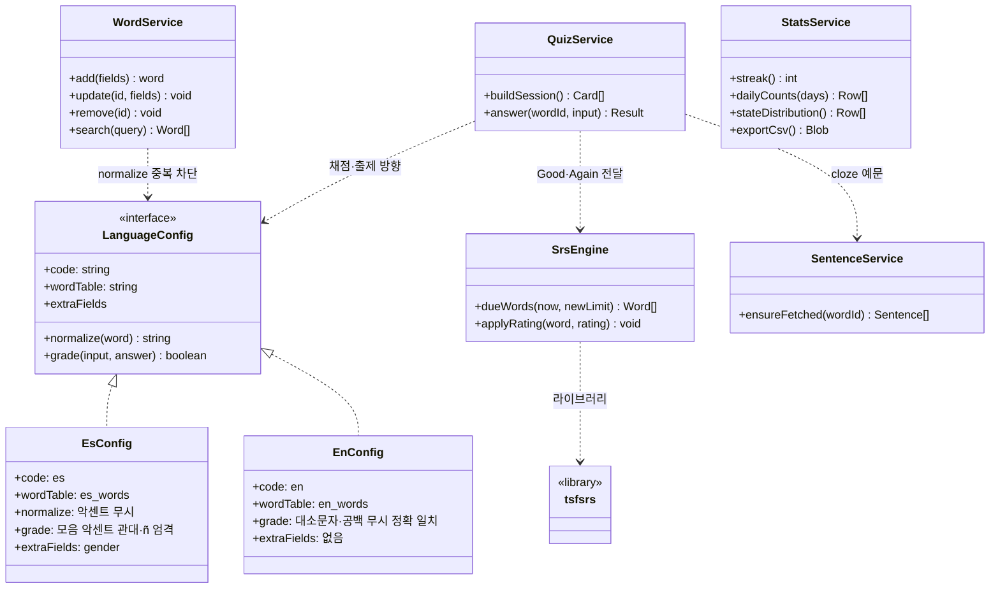
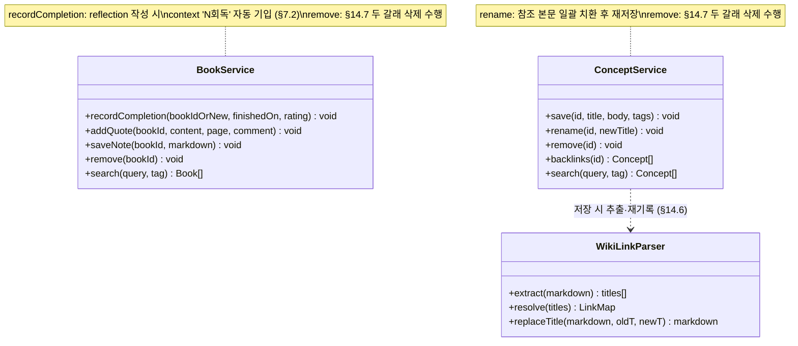

> LSHobby 설계 문서 — 목차·로드맵·§번호↔파일 매핑은 [README](README.md) 참조

> **개정 예고 (2026-08-20, 결정 #57~59)**: CS 세션 제거 · 인용구 기능 삭제 · 책 세션 = 독서 여정 책장(탭바 없음) · 탭바 [홈] 슬롯 폐지(우상단 홈 버튼). 본 문서의 관련 항목(CS/knowledge·concept·quote·인용구·구 내비 문법)은 §10 결정 로그가 우선하며, 코드·DB 반영 시 본문을 개정한다.

## 15. 설계 클래스 다이어그램 (DCD) — 확정 (2026-08-14)

구현이 TypeScript 모듈(함수) 중심이므로 여기서 "클래스" = **모듈의 공개 인터페이스**(§3.4-1: `index.ts`로만 노출되는 서비스)와 언어 config 타입이다. DB 스키마의 원본은 §9(ERD/DDL) — 이 문서는 **코드 관점의 책임과 의존 방향**을 고정한다.

### 15.1 모듈 의존 방향 (전체 조감)

- 화살표 = 허용된 의존. **역방향(shared → 도메인)·도메인 간 직접 의존은 금지**(§3.4)
- 도메인 간 정보 전달은 `activity` 이벤트 발행이 유일한 통로 — 홈은 activity만 읽는다(§5.3)
- language가 reflection을 안 쓰는 것은 현재 화면에 단어 상세가 없어서일 뿐 — 추후 단어 상세 추가 시 허용 방향(§11.7)
- cv는 shared 중 auth(편집 가드)와 markdown 렌더만 사용 — reflection·activity·tag 미사용 (§17.7)

### 15.2 shared 모듈

- reflection 블록의 **렌더링도 shared 소유**(§11.7) — 도메인 화면은 subject만 넘긴다
- 다형 참조(subjectType+subjectId)의 무결성 책임은 이 서비스들을 호출하는 앱 레이어에 있음(§4.5, 삭제는 §14.7)

### 15.3 language 모듈 — config 주입 구조 (§6.2)

- **언어 추가 = config 구현 1개 + 테이블 복제** — 서비스 코드는 전 언어 공용 한 벌(FR-18의 구현 형태)
- StatsService·SrsEngine의 신규 한도·어려운 단어 판정은 전부 `*_review_log` 파생 — 카운터 상태 없음(#36)

### 15.4 library · knowledge 모듈

### 15.5 테이블 소유권 (모듈 ↔ §9 DDL 매핑)

| 모듈 | 소유 테이블 | 비고 |
|---|---|---|
| shared | `reflection_thread` · `reflection_entry` · `activity_feed` · `tag` · `tagging` | 타 모듈은 서비스 경유로만 접근 |
| language | `es_words` · `es_review_log` · `es_sentences` · `es_sentence_fetch` · `en_*` 4종 | 언어 추가 = config + 테이블 복제 (#54) |
| library | `book` · `reading` · `quote` | |
| knowledge | `concept` · `concept_link` | |
| cv | `cv_document` | 유일한 anon SELECT 테이블 (§17, #51) |

**각 모듈은 자기 테이블만 쿼리한다**(§3.4-2). 이 표가 코드 리뷰 때의 경계 판정 기준.

### 15.6 유지보수 불변식 요약

구현·수정 시 깨뜨리면 안 되는 것들 (원본 § 참조):

1. `reflection_entry`는 UPDATE/DELETE 경로가 코드에 존재하지 않는다 — append-only (§4.2)
2. 엔티티 삭제는 항상 두 갈래: DB cascade + 앱 레이어 다형 행 정리 (§14.7)
3. `activity_feed`는 어떤 삭제에도 휩쓸리지 않는다 — 영구 보존 (§9.3)
4. 홈은 `activity_feed` 외의 도메인 테이블을 읽지 않는다 (§5.3)
5. 학습 수치는 전부 `*_review_log` 파생 — 카운터 컬럼을 새로 만들지 않는다 (#36)
6. 언어별 분기는 `LanguageConfig` 안에만 존재한다 — 서비스 코드에 `if (lang === 'es')` 금지 (§6.2)
