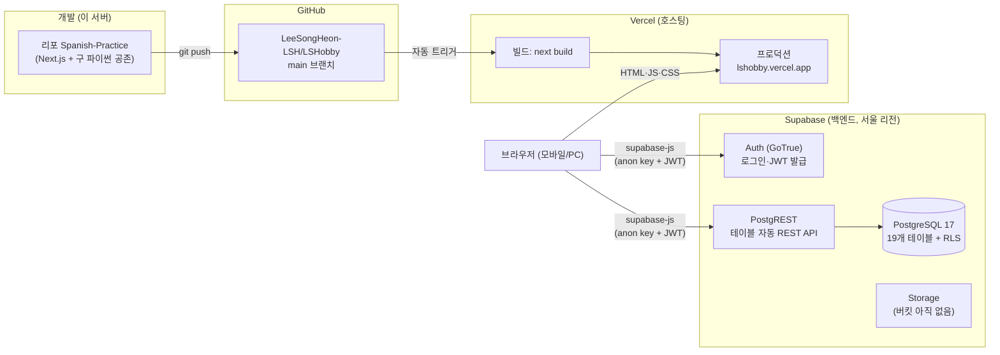
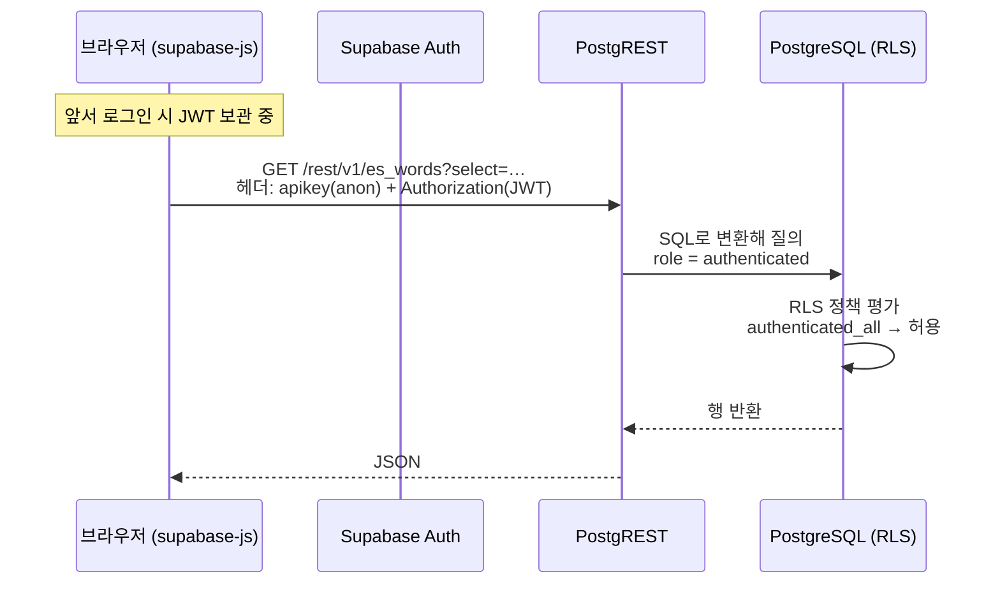
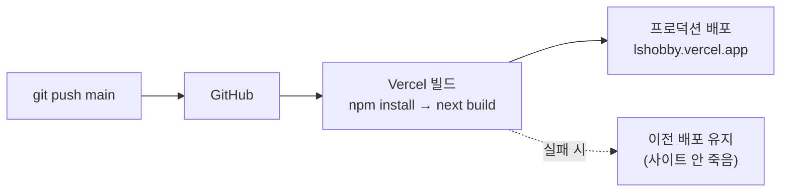

> LSHobby 설계 문서 — 목차·로드맵·§번호↔파일 매핑은 [README](README.md) 참조

## 16. 인프라 구조 해설 — 현재 상태 (2026-08-14 세팅 완료 기준)

§2(스택 선정 이유)·§12(보안 요구)의 결과물로 **실제로 세워진 인프라가 어떻게 맞물려 도는지**를 학습용으로 풀어쓴 문서. 규칙의 원본은 §12, 여기는 "왜 이렇게 생겼고 요청이 어디로 흐르는가"를 설명한다.

### 16.1 전체 그림



핵심 구조 두 가지:

1. **서버 코드가 거의 없는 구조** — 데이터 요청은 Next.js 서버를 거치지 않고 **브라우저 → Supabase 직행**이 기본이다. Vercel은 화면(정적 자산)을 주는 역할, Supabase가 API·DB·인증 전부를 담당한다. 백엔드를 직접 짜는 대신 PostgREST가 테이블마다 REST API를 자동 생성해 준다.
2. **보안의 최종 방어선은 DB 안(RLS)에 있다** — API가 브라우저에 열려 있으므로, "누가 뭘 읽고 쓸 수 있나"는 서버 코드가 아니라 Postgres의 Row Level Security 정책이 결정한다(§16.3).

### 16.2 구성요소별 역할

| 구성요소 | 역할 | 우리 설정 |
|---|---|---|
| **GitHub** | 소스 저장 + 배포 트리거 | `main` 푸시 = 프로덕션 배포 (Vercel GitHub App 연동) |
| **Vercel** | 빌드·CDN·호스팅 | 프로젝트 `lshobby`, 환경변수 3종 등록, 프리뷰/프로덕션 분리 |
| **Next.js** | 화면 + (필요 시) 서버 코드 | 16.x, App Router, `src/` 구조 — 모듈 경계는 §3 |
| **Supabase Auth** | 로그인·세션(JWT) | 이메일 로그인, **가입 서버 차단**(SEC-01), 계정 1개 |
| **PostgREST** | 테이블 → REST API 자동화 | supabase-js가 클라이언트. 모든 요청에 RLS 적용 |
| **PostgreSQL** | 데이터 원본 | §9 DDL = `supabase/migrations/` 파일로 형상 관리 |
| **Storage** | 파일(이미지) | CS 모듈 때 private 버킷 생성 예정(SEC-04) |

### 16.3 데이터 요청 한 번이 흐르는 길

"단어장 목록을 연다"를 예로:



- **anon key**: "이 Supabase 프로젝트의 클라이언트"임을 나타내는 공개 가능한 키. 이것만으로는 role이 `anon`이라 **RLS에서 전부 거부**된다 (실측: SELECT 0행, INSERT 거부)
- **JWT**: 로그인 시 Auth가 발급. 이게 붙어야 role이 `authenticated`가 되고, 우리 정책("authenticated 전부 허용", #33)이 통과시킨다
- 즉 "로그인함 = 본인 = 전부 허용"이 성립하는 전제는 **가입이 서버에서 차단**돼 있다는 것(SEC-01). 이 사슬이 §12.4 위협 모델의 답이다

### 16.4 키·비밀 체계 (무엇이 어디에, 왜)

| 비밀 | 성격 | 위치 | 용도 |
|---|---|---|---|
| anon key | **공개돼도 됨** (RLS가 방어) | `.env`, Vercel env, 브라우저 번들 | 클라이언트 접속 |
| service_role key | **절대 비공개** — RLS를 통째로 우회 | `.env`(로컬), Vercel env(server-only), `~/.lshobby/api-keys.json` | 관리 작업(계정 생성·SEC-08 재설정), 추후 서버 코드 |
| DB 비밀번호 | 비공개 | `~/.lshobby/db-password` | `pg_dump` 백업(NFR-04), `supabase link` |
| 앱 로그인 비밀번호 | 본인만 | `~/.lshobby/app-password` (+비밀번호 관리자) | 앱 로그인. 분실 시 SEC-08 런북 |
| Supabase/Vercel 대시보드 계정 | **최상위 복구 수단** | GitHub 로그인 | 모든 것의 마스터 키 |

규칙(SEC-03): 비밀은 `.env`(gitignore)와 Vercel env로만 — 코드·리포에 하드코딩 금지. **`NEXT_PUBLIC_` 접두사가 붙은 변수만 브라우저 번들에 들어간다**는 Next.js 규칙이 anon(공개)과 service_role(서버 전용)의 경계를 코드 레벨에서 지켜준다.

### 16.5 배포 파이프라인



- **main 푸시 = 프로덕션**. 다른 브랜치를 푸시하면 고유 URL의 **프리뷰 배포**가 생긴다 (컷오버 전 기능 확인에 활용 가능)
- 빌드가 실패하면 배포되지 않고 직전 버전이 계속 서빙된다 — 푸시가 사이트를 깨뜨리지 않는 구조
- `vercel deploy` CLI 직접 배포는 이제 쓰지 않는다. **주의 이력**: CLI 배포는 `.gitignore`를 무시하고 `.env`를 업로드해서 `.vercelignore`로 차단해 뒀다 (2026-08-14 실제 발생·조치)

### 16.6 스키마 변경 절차 (형상 관리)

DB 스키마의 진실은 대시보드가 아니라 **리포의 마이그레이션 파일**이다:

```
supabase/migrations/20260814224424_initial_schema.sql   ← §9 DDL 원본
```

변경 순서: ① 새 마이그레이션 파일 작성(`supabase migration new 이름`) → ② `supabase db push`로 원격 적용 → ③ 커밋. 대시보드에서 손으로 고치면 리포와 어긋나므로 금지. 영어 확장(`en_*` 4테이블)도 이 절차로 파일 하나 추가하면 된다(§6.2).

### 16.7 로컬 개발 ↔ 프로덕션

| | 로컬 (`npm run dev`) | 프로덕션 |
|---|---|---|
| 화면 | localhost:3000 | lshobby.vercel.app |
| 환경변수 | `.env` 파일 | Vercel env (대시보드/CLI 등록분) |
| DB | **같은 Supabase를 바라봄** | 같음 |

로컬 개발도 프로덕션 DB를 직접 쓴다 — 1인 프로젝트라 dev/prod DB 분리를 하지 않았다(단순성 우선). 파괴적인 실험이 필요하면 그때 `supabase start`(로컬 Docker DB)를 검토.

### 16.8 구 파이썬 앱과의 공존 — **종료됨 (2026-08-15 컷오버, #49)**

> 아래는 기록용. 파이썬 앱·systemd 유닛·pytest CI는 삭제됐고(git 히스토리 보존), `spanish.db`는 `~/spanish.db.bak-cutover-20260815`로 백업됨. Tailscale serve 프록시 해제만 sudo 필요로 남음.

```
같은 리포 안:
  main.py, quiz.py, …, spanish.db   ← 구 앱 (Tailscale 사설망 + systemd, 계속 운영 중)
  package.json, src/, supabase/     ← 신 앱 (Vercel + Supabase)
```

- 두 앱은 **저장소만 공유하고 실행 환경·DB가 완전히 분리**되어 있다. 신 앱 작업이 구 앱을 건드릴 일 없음
- 구 앱의 2분 주기 자동 배포(systemd)는 git pull 기반이라, 신 앱 파일이 늘어나도 영향 없음 (단, 로컬 작업 트리가 dirty면 구 앱 배포가 멈추는 규칙은 여전— 커밋을 자주)
- §6.5 컷오버 시: 파이썬 파일·systemd 유닛 삭제, `spanish.db`는 파일 백업만

### 16.9 무료 티어 한계와 운영 수칙

- **Supabase Free**: DB 500MB · Storage 1GB · 자동 백업 없음 → **`pg_dump` 주 1회**(NFR-04). 장기 무활동 시 프로젝트 일시정지 가능(상시 사용이면 무관)
- **Vercel Hobby**: 대역폭 100GB/월 — 1인 사용에 충분
- 락인 회피(§2.2): DB·Storage가 전부 Supabase(표준 Postgres)에 있으므로 Vercel 이전은 재배포 수준, Supabase 이전은 `pg_dump` 복원 수준

### 16.10 식별자 모음 (운영 참조)

| 항목 | 값 |
|---|---|
| Supabase 프로젝트 | `pxozfdypiexwakocfofs` (서울 ap-northeast-2) |
| Supabase URL | `https://pxozfdypiexwakocfofs.supabase.co` |
| Vercel 프로젝트 | `lshobby` (팀 `lsh12`) |
| 프로덕션 URL | https://lshobby.vercel.app |
| 앱 계정 | leesongheon1209@gmail.com (1계정, 가입 차단) |
| 비밀 보관 | `~/.lshobby/` (600 권한) + 리포 `.env`(gitignore) |

### 16.11 로컬 LLM(Ollama) — 다이제스트 배치 전용

생각 세션의 하루 요약 배치(`scripts/digest-thoughts.mjs`, 집 PC cron 00:30)는 이 PC의 **로컬 Ollama**(`localhost:11434`, 기본 바인딩)로 exaone3.5:7.8b를 돌린다. 정책은 단순하다 — **생각 데이터는 어떤 외부 API로도 보내지 않는다.** 그래서 클라우드 추론은 쓰지 않고, Ollama는 네트워크에 노출하지 않는다.

> **철회 기록 (#63)**: 철학 정보 탭(브라우저→Ollama 문답 + 한↔영 통역)과 그를 위한 tailnet 노출(`tailscale serve :8443`, `OLLAMA_HOST` tailscale IP 바인딩, CORS, Vercel `NEXT_PUBLIC_OLLAMA_URL`)은 2026-08-24 당일 도입·철회했다. 구성과 근거는 git 히스토리에 보존(커밋 505629d 시점의 §16.11). 브라우저에서 Ollama를 다시 부를 일이 생기면 그 기록대로 재구성하면 된다.

### 16.12 Notion 활동 미러 (#64)

홈 타임라인의 원천인 `activity_feed`를 **Notion DB 하나에 단방향으로 append** 한다 — 앱이 원본, Notion은 일지 뷰용 사본(Notion 쪽 수정·삭제는 앱에 안 돌아온다).

```
집 PC cron 00:40 → node --env-file=.env scripts/sync-activity-notion.mjs
  ① Notion DB의 최대 activity_id 조회 (커서 저장소 없음 — 사본에 직접 묻기)
  ② activity_feed에서 그 이후 id · 어제까지 · 포함 도메인만 조회
  ③ 행 → 표준 이벤트 배열 → id 오름차순 전송, 실패 시 중단 (다음 실행이 소급)
```

| 항목 | 값 | 이유 |
|---|---|---|
| 포함 도메인 | `library` `language` `cv` (포함 목록) | **thought 제외** — 생각 데이터 외부 반출 금지(§16.11). summary에 생각 원문 첫 줄이 들어 있다 |
| 전송 경계 | `occurred_at` < 오늘 0시 | 언어의 당일 1건 갱신(upsertDaily)이 확정된 뒤에만 박제 |
| Notion DB 속성 | 요약(제목)·날짜·도메인(선택)·액션(선택)·activity_id(숫자) | activity_id가 커서·중복 방지의 열쇠 |
| 비밀 | `.env`의 `NOTION_TOKEN`·`NOTION_DB_ID` | integration은 이 DB 하나만 공유받는다 |
| 실패 정책 | 로그만, 알림 없음 | PC 꺼짐·Notion 장애는 다음 실행이 따라잡는다 (#45와 같은 1인 규모 판단) |

어댑터 계층은 두지 않았다(#64) — 다른 기록 앱으로 갈아탈 때는 스크립트의 "행→표준 이벤트 배열" 경계 아래(`sendToNotion`)만 바꾸면 된다.
