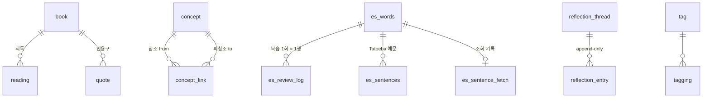

# LSHobby — 개인 지식·취미 관리 웹앱 설계 진행 문서

> **작성일**: 2026-08-14 (언어·책·CS 모듈 + ERD/DDL 확정: 2026-08-14)
> **앱 이름**: **LSHobby** — GitHub 리포 `LeeSongHeon-LSH/LSHobby` (구 Spanish-Practice에서 개명 완료)
> **상태**: 아키텍처·화면구조·세 모듈(언어·책·CS)·ERD/DDL 전부 확정
> **다음 작업**: 화면 와이어프레임 — 모바일 우선 (§6.6 로드맵 참조)

---

## 1. 프로젝트 개요

개인의 취미 생활과 학습을 한곳에 집대성하는 웹 애플리케이션.
세 영역(책 / 언어 / CS)을 다루되, **각 영역이 화면상 명확히 분리**되어야 하며,
공통적으로 **"시간에 따라 생각이 변하는 과정"을 기록**하는 것이 핵심 가치.

### 1.1 세 가지 세션

| 세션 | 내용 |
|---|---|
| 📚 **책 (library)** | 탐독한 책 목록 관리, 간단한 내용 정리, 장르별 구분 |
| 🗣 **언어 (language)** | 스페인어 학습 (기존 웹앱 존재) + 영어 확장 |
| 💻 **CS (knowledge)** | 컴퓨터공학 학습 내용 정리 및 관리 |

---

## 2. 기술 스택 (확정)

| 레이어 | 선택 | 비고 |
|---|---|---|
| 프레임워크 | **Next.js (React)** | 프론트 + API Routes |
| 스타일 | **Tailwind CSS** | 모바일 우선 반응형 |
| DB | **Supabase (PostgreSQL)** | 무료 티어 |
| 인증 | **Supabase Auth** | |
| 스토리지 | **Supabase Storage** | 이미지/첨부 |
| 배포 | **Vercel** | GitHub 연동 자동 배포 |
| 비용 | **0원** | 개인 취미 프로젝트 범위 내 |

### 2.1 왜 AWS가 아닌가
- 취미 프로젝트에 월 4~6만원 + 서버 관리 부담은 오버킬
- Vercel + Supabase 무료 티어로 충분 (DB 500MB, 스토리지 1GB, 대역폭 100GB/월)

### 2.2 락인(lock-in) 회피 원칙
Vercel이 유료화되어도 쉽게 이전할 수 있도록 다음을 지킨다.

- [ ] **DB는 Supabase 사용** — Vercel Postgres/KV/Blob **사용 금지**
- [ ] 파일/이미지도 Supabase Storage (또는 Cloudflare R2)
- [ ] 모든 연결 정보는 **환경변수**로 관리, 코드 하드코딩 금지
- [ ] Vercel 전용 API 최소화, 표준 Next.js 기능 위주
- [ ] 정기 백업 (`pg_dump`)

> 이 원칙을 지키면 Vercel → Netlify/Cloudflare/Railway 이전은 30분~1시간,
> Supabase → 다른 PostgreSQL 이전은 반나절 수준.

### 2.3 모바일 우선 설계
입력의 대부분이 모바일에서 발생하므로 **모바일 우선 → PC 확장** 순서로 설계.

```
스페인어 단어 암기  → 지하철, 자투리 시간 → 📱
독서 중 인용구 기록  → 책 읽다가 바로      → 📱
추억/사진 기록      → 찍은 그 자리에서     → 📱
월간 회고, 통계     → 책상 앞에서          → 💻
```

**모바일 체크포인트**
- 터치 타겟 44px 이상
- 하단 탭 네비게이션 (상단 메뉴는 한 손으로 못 닿음)
- 입력 폼 최소화 (필드 2~3개)
- 사진 업로드 전 클라이언트 리사이즈
- **PWA 적용 검토** (홈 화면 추가 → 앱처럼 사용, 오프라인 캐싱)

---

## 3. 아키텍처 (확정) — Modular Monolith

### 3.1 MSA를 선택하지 않은 이유

| MSA가 필요한 조건 | 본 프로젝트 |
|---|---|
| 팀이 여럿, 독립 배포 필요 | 1인 개발 ❌ |
| 서비스별 스케일 요구가 다름 | 사용자 = 본인 1명 ❌ |
| 기술 스택을 다르게 가져가야 함 | 전부 Next.js ❌ |
| 장애 격리가 중요 | 취미 프로젝트 ❌ |

추가로, 세 도메인의 **경계가 흐릿함**이 결정적이다.
"스페인어 원서를 읽고 정리했다" = 책이자 언어 학습.
MSA로 쪼개면 이런 교차 케이스마다 서비스 간 조인이 필요해지지만,
모듈러 모놀리스에서는 DB 조인 한 줄로 끝난다.

> **결론: Modular Monolith. 단, 모듈 경계는 MSA 수준으로 엄격하게 유지.**
> 나중에 필요하면 모듈 하나를 서비스로 승격할 수 있도록 지금부터 경계를 지킨다.

### 3.2 디렉터리 구조

```
src/
├── modules/
│   ├── library/          # 책
│   ├── language/         # 언어 (기존 스페인어 코드 흡수)
│   ├── knowledge/        # CS
│   └── shared/
│       ├── reflection/   # ★ 생각 기록 타임라인 (핵심)
│       ├── activity/     # 활동 피드
│       ├── tag/
│       ├── search/
│       └── auth/
└── app/
    ├── (home)/           # 통합 홈 (허브)
    ├── library/          # 세션별 전용 레이아웃
    ├── language/
    └── knowledge/
```

### 3.3 계층 구조

```
┌─────────────────────────────────────────────┐
│  library      │  language     │  knowledge   │  ← 도메인 모듈
└───────┬───────┴───────┬───────┴──────┬───────┘
        │               │              │
        └───────────────┼──────────────┘
                        ▼
        ┌───────────────────────────────┐
        │  shared                        │
        │  ├── reflection (생각 타임라인) │  ← 핵심
        │  ├── activity   (활동 피드)     │
        │  ├── tag / search / auth       │
        └───────────────────────────────┘
```

### 3.4 모듈 경계 규칙 (아키텍처 침식 방지)

1. **모듈 간 직접 import 금지** — 공개 인터페이스(`index.ts`)를 통해서만 접근
2. **각 모듈은 자기 테이블만 소유** — 타 모듈 테이블 직접 쿼리 금지
3. **모듈 간 통신은 이벤트 발행으로** — `shared/activity`가 수신
4. 공통 관심사(reflection, tag, search)는 `shared`에 위치
5. 도메인 모듈은 `shared`에 의존 가능, **역방향 의존 금지**

> 이 규칙들은 향후 정적 검사(import 경로 lint 규칙 등)로 강제하는 것을 검토.

---

## 4. 핵심 기능: Reflection (생각 기록) — 확정

### 4.1 정의

단순 메모가 아니라 **시간에 따른 생각의 변화 과정**을 기록하는 기능.
"한 번 더 읽거나 생각이 바뀌었을 때 변화 과정을 살펴보기 위해" 존재한다.

**흔한 독서 기록 앱에 없는 기능이며, 본 앱의 정체성.**

### 4.2 방식: A안 (append-only) 확정

| 안 | 방식 | 채택 |
|---|---|---|
| **A. 追記형** | 원본은 그대로, 아래에 새 생각을 계속 쌓음. 타임라인처럼 읽힘 | ✅ **채택** |
| B. 개정형 | 생각을 수정하되 이전 버전 스냅샷 보관 (Git diff 방식) | ❌ |

A안 선택으로 수정 이력 테이블이 불필요해져 스키마가 단순해진다.

### 4.3 적용 범위: shared 모듈 핵심 기능 — 확정

책 전용이 아니라 **세 도메인 공통**으로 사용한다.

```
책     → "이 책을 처음 읽었을 때는 …, 재독하니 …"
언어    → "이 표현을 이렇게 이해했는데, 원어민 용법을 보니 …"
CS     → "이 알고리즘을 처음엔 이렇게 이해했는데 지금은 다르게 본다"
```

**이점**: 도메인 횡단 회고가 공짜로 나온다.
예: *"올해 내 생각이 가장 많이 바뀐 것들"*

### 4.4 스키마 초안

```sql
-- 생각을 붙일 수 있는 대상 (다형 참조)
reflection_thread (
  id,
  subject_type,   -- 'book' | 'es_word' | 'concept' — 테이블 특정 값 (§9.3에서 'vocab' 정정)
  subject_id,     -- 각 모듈의 엔티티 id
  created_at
)

-- 시간순으로 쌓이는 생각들 (append-only)
reflection_entry (
  id,
  thread_id,
  content,        -- 그때의 생각
  context,        -- 선택: '재독', '3개월 후' 같은 계기 메모
  created_at      -- 이 순서가 곧 타임라인
)
```

### 4.5 설계 트레이드오프 — 다형 참조 채택

`subject_type` + `subject_id` 방식은 **FK 무결성을 DB가 보장하지 못한다**
(book_id인지 vocab_id인지 DB는 알 수 없음).

| 대안 | 장점 | 단점 |
|---|---|---|
| **다형 참조** ✅ 채택 | 공통 조회 용이, shared 핵심 기능화 가능 | DB 레벨 FK 무결성 없음 |
| 모듈별 분리 테이블 | FK 무결성 보장 | 도메인 횡단 조회 어려움 |

> **결정**: 다형 참조로 진행. 무결성은 **애플리케이션 레이어에서 보장**한다.
> (진단센터 DDL의 RLS 논의와 동일한 성격의 트레이드오프)

---

## 5. 화면 구조 (확정)

### 5.1 방식: B안 — 통합 홈 + 세션 탭

**의도**: 한 화면에 세 기능이 **모호하게 합쳐지는 것을 방지**.
홈은 허브 역할만 하고, 각 세션에 들어가면 완전히 다른 전용 공간.

```
┌─ 홈 (허브) ────────────────────┐
│  [📚 책] [🗣 언어] [💻 CS]      │  ← 세션 선택 (큰 카드 3개)
│  ─────────────────────────     │
│  최근 기록 타임라인              │  ← 도메인 횡단, 시간순
│   · 어제  「사피엔스」 p.120 인용 │
│   · 어제  단어 12개 복습         │
│   · 3일전 Raft 합의 정리 추가    │
└────────────────────────────────┘
         ↓ 세션 선택
┌─ 각 세션 (전용 공간) ───────────┐
│  세션마다 완전히 다른 레이아웃    │
│  하단 탭도 그 세션 메뉴로 전환    │
└────────────────────────────────┘
```

### 5.2 홈 첫 화면 구성 — 확정
- **세션 선택 화면** (큰 카드 3개)
- **최근 기록 타임라인** (도메인 횡단, 시간순)

> "오늘 할 일(복습 N개 등)"은 홈 첫 화면에 넣지 않기로 함.
> SRS 확정(§6.3) 후 재검토 완료 — **원안 유지, 복습 배지도 두지 않음**.
> 복습 수는 언어 세션에 들어가야 보인다. (매일 세션에 진입하는 습관이 전제임을 인지한 선택)

### 5.3 활동 피드 — 모듈 경계를 지키는 타임라인

홈 타임라인은 세 모듈의 활동을 시간순으로 섞어 보여줘야 하지만,
**모듈 경계 규칙상 각 모듈 테이블을 직접 조인할 수 없다.**

해법: `shared`에 활동 피드 테이블을 두고, 각 모듈이 이벤트를 발행한다.

```sql
activity_feed (
  id,
  domain,        -- 'library' | 'language' | 'knowledge'
  entity_type,   -- 'book' | 'vocab' | 'concept' | 'reflection'
  entity_id,
  action,        -- 'created' | 'updated' | 'reflected' | 'completed'
  summary,       -- 타임라인 표시용 한 줄 (비정규화)
  occurred_at
)
```

**`summary` 비정규화가 핵심.** 정규화하면 타임라인 렌더링마다 세 모듈을
모두 조회해야 하므로 홈이 느려지고 모듈 경계도 깨진다.

→ 홈은 이 테이블 **하나만** 읽는다. 모듈 간 직접 참조 없음.
→ 향후 모듈을 서비스로 분리할 때도 이벤트만 발행하면 되므로 확장에 유리.

### 5.4 세션별 화면 성격 (초안)

| 세션 | 주된 행위 | 리듬 | 어울리는 레이아웃 |
|---|---|---|---|
| 📚 **책** | 완독 후 인용·생각을 쌓음 | 천천히 깊게 | 타이포그래피 카드 리스트(표지 없음) → 상세는 긴 글 읽기 (§7.3) |
| 🗣 **언어** | 짧게 자주, 반복 학습 | 빠르게 자주 | 카드 스와이프 / 퀵 입력 중심 |
| 💻 **CS** | 개념을 정리하고 연결 | 구조적으로 | 문서형, 태그 + 위키링크 (§8.2 — 계층 트리는 폐기) |

---

## 6. 언어 모듈 설계 — 확정 (2026-08-14)

### 6.1 기존 스페인어 웹앱 구조 (파악 완료)

- **스택**: FastAPI + 단일 `index.html`(바닐라 JS) + SQLite(`spanish.db`), PWA(sw.js), 인증 없음(Tailscale 사설망 = 인증)
- **기능**: 단어 CRUD, SRS 퀴즈(Leitner 5박스 + 하루 새 단어 20개 한도 + 오답률 가중 출제), 어려운 단어 집중 모드, Tatoeba 예문 cloze, 통계/스트릭, CSV export
- **데이터**: 시드 218단어만 존재, 학습 이력(attempts) 0건 → **마이그레이션 부담 사실상 없음** (시드 이식이 전부)
- **배포**: systemd user 서비스 + 2분 타이머 CD + Tailscale https

### 6.2 언어 구조 — B안 확정 (언어별 테이블 + 공용 엔진)

- **단일 Supabase 프로젝트** 안에서 언어별 테이블(`es_words`, `en_words`, …). DB 인스턴스는 하나 — 언어 추가 비용 0원
- 각 테이블이 **자기 SRS 컬럼을 보유** (공용 review_state 테이블 없음 — reflection에서 지적한 다형 참조 문제를 언어 모듈 안에 또 만들지 않음)
- 퀴즈/SRS/통계 로직은 **코드 레벨 공용 엔진 한 벌**. 언어 추가 = 테이블 1개 + config 등록
- 언어 config는 **코드 객체**(테이블명, 채점 함수, 특수 필드 렌더링) — DB에 언어 메타 테이블 없음
- **채점·중복차단(norm) 규칙**: 스페인어 = 모음 악센트 관대·ñ 엄격(현행 유지) / 영어 = 대소문자·앞뒤 공백 무시 정확 일치
- `gender`(el/la) 같은 특수 필드는 해당 언어 테이블에만 존재

### 6.3 SRS — FSRS 확정 (Leitner 폐기)

- **FSRS** (`ts-fsrs` 라이브러리). 단어당 stability, difficulty, due, state 저장
- **평가 입력**: 타이핑 자동 채점 → 정답=Good, 오답=Again 이분 매핑. 자가평가 버튼 없음 (추후 정답 시 Hard/Easy 버튼 추가 여지)
- 새 카드 일일 한도(20개), 어려운 단어 집중 모드 개념은 FSRS 체계로 이식
- §5.2 재검토 결과: **홈 복습 배지 없음** (원안 유지)

### 6.4 activity_feed 발행 단위

- 단어 추가: **건별** 이벤트
- 학습(복습): **일별 요약 1건** ("단어 12개 복습, 정답률 83%" — 당일 재학습 시 갱신)

### 6.5 전환 전략 — 빅뱅 교체

- Next.js로 재작성 **완성 후 한 번에 교체**. 완성까지 기존 앱 계속 운영
- **컷오버 기준** (전부 Vercel에서 동작 확인):
  단어 CRUD / FSRS 퀴즈 / Tatoeba cloze / 통계·스트릭 / CSV export / 시드 218단어 이식 / Supabase Auth(본인 1계정) / PWA 설치
  + 허브·activity_feed·reflection **골격 포함**, 언어 세션만 채운 상태로 출시
- **영어·책·CS 모듈은 컷오버 이후** 확장
- **컷오버 시 정리**: 파이썬 파일 전부 삭제(git 히스토리 보존), systemd 유닛 3종 해제·삭제, pytest GitHub Actions 제거, `spanish.db`는 파일 백업만 유지
- **UI 전면 재디자인** — azulejo 컨셉 폐기 (언어가 늘어나므로 스페인어 특화 자산을 남기지 않음)
- **PWA**: 설치형 최소(manifest + 기본 캐싱), 오프라인 퀴즈 없음 — 실사용에서 필요해지면 재검토
- **테스트**: vitest 단위 테스트(SRS 엔진·채점 규칙 위주), e2e는 초기 생략

### 6.6 이후 로드맵

1. ~~언어 모듈 상세 설계~~ ✅ (본 §6)
2. ~~책 모듈 상세 설계~~ ✅ (§7)
3. ~~CS 모듈 상세 설계~~ ✅ (§8)
4. ~~전체 ERD 통합 및 DDL 작성~~ ✅ (§9)
5. **화면 와이어프레임 (모바일 우선)** ← 다음 차례
6. 프로젝트 초기 세팅 (Next.js + Supabase 연결)
7. 스페인어 컷오버 (§6.5 기준 충족 시 구 앱·인프라 정리)

---

## 7. 책 모듈 설계 — 확정 (2026-08-14)

### 7.1 데이터 모델

- **`book`**: 제목 / 저자 / 옮긴이(선택) / 출판사 / 원저 발표연도 — 전부 텍스트. **표지 이미지 없음** (철학 번역서 중심이라 표지의 정체성이 약하고, 필요해지면 nullable 컬럼 추가로 확장 가능)
- **등록**: 수기 입력만 — 외부 책 검색 API 사용 안 함 (표지를 버리면 자동채움의 실익이 텍스트 4~5필드뿐이라 마찰이 충분히 작음. 등록이 귀찮아지면 카카오 책 검색 추가 검토 — 스키마 영향 0)
- **등록 범위**: **완독한 책만** (§1.1 "탐독한 책 목록"). 위시리스트·"읽는 중"·"중단" 같은 독서 상태 없음. 필요해지면 "회독 0회 책 = 읽을 예정"으로 비용 없이 확장 가능
- **장르**: 자유 태그 — `shared/tag` 재사용. 고정 ENUM 없음. "스페인어 원서 = 책 + 언어" 같은 교차 케이스도 태그로 해결
- **`reading` (회독)**: 완독 이벤트만 기록 — `book_id`, `finished_on`(미입력 시 기록일), `rating`(선택, ★1~5). 시작일·상태 없음. 재독 = 새 레코드 → "1회독 ★3 (2025.3) → 2회독 ★5 (2026.8)"이 데이터로 남음
- **`quote` (인용구)**: `book_id`, 본문, 페이지, 한 줄 코멘트(선택). 완독 후 몰아서 입력. 책 횡단 인용구 모아보기·검색 지원
- **노트**: 책당 마크다운 노트 1개, 자유 수정 — 정적 요약(줄거리·구조 정리)용. append-only인 reflection이 못 하는 "다듬기"를 담당
- **reflection**: book 단위 스레드(shared 기능 그대로, `subject_type='book'`). 인용구 단위 스레드는 만들지 않음 (필요 시 subject_type 추가로 확장)

### 7.2 워크플로 — 완독 후 일괄 기록

중간 기록은 하지 않는다. 책을 전부 읽은 뒤에만 기록한다.

```
책을 다 읽음
  → (첫 회독이면) 책 등록
  → 회독 +1 (완독일 자동)
  → 별점 (선택)
  → 인용구·노트·reflection 작성 (선택, 순서 자유)
```

- reflection entry의 `context`에 **"N회독" 자동 기입** — 회독 기록과 생각 타임라인이 맞물림
- activity_feed 발행: 등록/완독/인용 추가/노트 갱신 전부 **건별** (책은 저빈도 도메인이라 도배 위험 없음 — 언어 모듈의 일별 요약과 굵기가 다른 것은 의도)
- 책 삭제 시 회독·인용·노트·reflection 스레드 함께 삭제

### 7.3 화면

- 목록: **표지 없는 타이포그래피 카드 리스트** — 제목·저자 크게, 태그·회독 수·별점 표시. 기본 정렬 최근 완독순, 태그 필터 + 텍스트 검색
- 상세: 긴 글 읽기 레이아웃 (메타데이터 → 회독 이력 → 노트 → 인용구 → reflection 타임라인)
- 구체 레이아웃은 와이어프레임 단계(§6.6-5)에서

### 7.4 인지된 트레이드오프

- **완독 전의 책을 앱이 전혀 모른다** — 홈 타임라인에도 완독 시점에야 나타남. "전부 읽은 뒤 기록" 철학에 따른 의도된 선택 (2026-08-14 확인)
- §5.4 초안의 "책 카드 그리드"는 표지 폐기로 타이포그래피 리스트로 대체됨

---

## 8. CS 모듈 설계 — 확정 (2026-08-14)

### 8.1 데이터 모델

- **`concept`**: 제목 + 마크다운 본문 + 자유 태그(`shared/tag` 재사용). **주제 단위 문서** — 개념 하나 = 문서 하나 (예: "Raft 합의", "B-Tree"). 아토믹 노트(Zettelkasten)·분야 페이지 방식은 기각 — 전자는 링크 관리가 일이 되고, 후자는 reflection을 붙일 `subject_id` 대상이 모호해짐
- **필드 한정**: 요약·상태("정리 중/완료") 필드 없음 — 목록 발췌는 본문 첫 줄, 미완성 문서는 그냥 짧은 문서 (책 모듈이 독서 상태를 두지 않은 것과 같은 철학)
- **본문 vs reflection**: 책과 동일 패턴 — 수정 자유 마크다운 본문(현재 이해의 정리본) + append-only reflection(이해가 바뀐 순간의 기록, `subject_type='concept'`)
- **코드 스니펫**: 별도 테이블 없음 — 본문 마크다운 코드펜스로 충분 (책의 quote는 본문이 앱 밖에 있어 그릇이 필요했지만, CS는 본문 자체가 앱 안의 내 문서). 언어별 모아보기가 실제로 필요해지면 테이블 추가로 확장
- **이미지·다이어그램**: 본문 삽입 지원 — Supabase Storage + 업로드 전 클라이언트 리사이즈(§2.3)

### 8.2 개념 간 연결 — 태그 + 위키링크

- **분류는 태그, 연결은 위키링크**: 계층 트리 없음 (태그 필터가 폴더 역할을 대체하고, 교차 개념 분류 고민 제거). 개념→개념 직접 연결은 본문 안 `[[다른 개념]]` 링크
- **`concept_link(from_id, to_id)`**: 저장 시 본문에서 `[[...]]`를 추출·제목으로 resolve해 기록 → 상세 화면에서 **백링크**("이 개념을 참조하는 문서") 자동 표시
- **링크 식별**: 제목 문자열 매칭. 개념 제목 변경 시 참조하는 모든 본문의 `[[옛제목]]`을 **일괄 치환** (Obsidian 방식 — 본문 마크다운이 사람이 읽는 그대로라 락인 회피 원칙과도 부합)
- **dangling 링크 허용**: 아직 없는 개념도 `[[제목]]`으로 미리 링크 가능 — red link로 렌더, 클릭 시 그 제목으로 생성 화면 진입. "다음에 정리할 개념" TODO가 본문 쓰다가 공짜로 생김. `concept_link`에는 resolve된 링크만 기록
- **삭제**: reflection 스레드·`concept_link` 행 cascade 삭제. 다른 본문에 남은 `[[제목]]`은 자연히 dangling으로 강등 — 별도 처리 불필요

### 8.3 화면

- **목록**: 문서 리스트(제목 · 태그 · 최종 수정일 · 본문 첫 줄 발췌), 기본 정렬 **최근 수정순**, 태그 필터 + 텍스트 검색
- **상세**: 본문(마크다운 렌더, 위키링크 활성) → 백링크 섹션 → reflection 타임라인 — 책 상세(§7.3)와 같은 "긴 글 읽기" 문법, 책의 회독·인용 자리에 백링크
- 구체 레이아웃은 와이어프레임 단계(§6.6-5)에서

### 8.4 스코프 제외 및 activity

- **SRS 복습 없음**: §1.1대로 "정리 및 관리"만. 암기 복습이 필요해져도 언어 모듈과 섞지 않고 별도 설계 (모듈 경계 유지)
- **벌크 임포트 없음**: 옮겨올 기존 정리 자산 없음 확인 (2026-08-14)
- **activity_feed**: 생성·reflection은 건별, **본문 수정은 개념당 당일 1건으로 갱신** (같은 날 여러 번 저장해도 타임라인엔 "정리 갱신" 1건 — 언어 모듈의 "당일 재학습 시 갱신" 패턴 재사용, 오탈자 수정 도배 방지)

---

## 9. 전체 ERD 및 DDL — 확정 (2026-08-14)

컷오버 시 이 DDL이 Supabase 마이그레이션 파일의 원본이 된다.
영어 확장 시에는 `es_*` 4개 테이블을 `en_*`으로 복제하고 언어 config를 등록하면 끝(§6.2).

### 9.1 ERD



FK 없는 다형 참조(그림에 없는 연결, §4.5):

- `reflection_thread(subject_type, subject_id)` ⇢ book · es_words · concept
- `tagging(subject_type, subject_id)` ⇢ book · concept
- `activity_feed(entity_type, entity_id)` ⇢ 전 도메인 (summary 비정규화라 원본 참조 자체가 불필요)

### 9.2 DDL

```sql
-- ============ shared ============

create table tag (
  id    bigint generated always as identity primary key,
  name  text not null unique
);

create table tagging (
  id           bigint generated always as identity primary key,
  tag_id       bigint not null references tag(id) on delete cascade,
  subject_type text not null,      -- 'book' | 'concept' (태그 대상이 늘면 값 추가)
  subject_id   bigint not null,    -- FK 없음: 다형 참조 (§4.5)
  unique (tag_id, subject_type, subject_id)
);
create index idx_tagging_subject on tagging (subject_type, subject_id);

create table reflection_thread (
  id           bigint generated always as identity primary key,
  subject_type text not null,      -- 'book' | 'es_word' | 'concept'
  subject_id   bigint not null,    -- FK 없음: 다형 참조
  created_at   timestamptz not null default now(),
  unique (subject_type, subject_id)   -- 엔티티당 스레드 1개
);

create table reflection_entry (
  id         bigint generated always as identity primary key,
  thread_id  bigint not null references reflection_thread(id) on delete cascade,
  content    text not null,
  context    text,                 -- 계기 메모 — 책은 'N회독' 자동 기입 (§7.2)
  created_at timestamptz not null default now()   -- 이 순서가 곧 타임라인
);
create index idx_reflection_entry_thread on reflection_entry (thread_id);

create table activity_feed (
  id          bigint generated always as identity primary key,
  domain      text not null,       -- 'library' | 'language' | 'knowledge'
  entity_type text not null,       -- 'book' | 'es_word' | 'concept' | 'reflection' …
  entity_id   bigint not null,     -- FK 없음: 엔티티 삭제 후에도 이벤트는 남는다 (§9.3)
  action      text not null,       -- 'created' | 'updated' | 'reflected' | 'completed' …
  summary     text not null,       -- 타임라인 한 줄 (비정규화 — 홈은 이 테이블만 읽음)
  occurred_at timestamptz not null default now()
);
create index idx_activity_feed_occurred on activity_feed (occurred_at desc);

-- ============ library ============

create table book (
  id         bigint generated always as identity primary key,
  title      text not null,
  author     text not null,
  translator text,                 -- 옮긴이 (선택)
  publisher  text not null,
  pub_year   text not null,        -- 원저 발표연도. 텍스트 — 'BC 380' 같은 값 허용
  note       text,                 -- 책당 1개 마크다운 노트 (§7.1)
  created_at timestamptz not null default now()
);

create table reading (
  id          bigint generated always as identity primary key,
  book_id     bigint not null references book(id) on delete cascade,
  finished_on date not null default current_date,        -- 미입력 시 기록일
  rating      smallint check (rating between 1 and 5),   -- 선택 별점
  created_at  timestamptz not null default now()
);
create index idx_reading_book on reading (book_id);

create table quote (
  id         bigint generated always as identity primary key,
  book_id    bigint not null references book(id) on delete cascade,
  content    text not null,
  page       int,                  -- 시작 페이지 (범위 인용은 코멘트에 부기)
  comment    text,                 -- 한 줄 코멘트 (선택)
  created_at timestamptz not null default now()
);
create index idx_quote_book on quote (book_id);

-- ============ knowledge ============

create table concept (
  id         bigint generated always as identity primary key,
  title      text not null unique, -- 위키링크가 제목으로 resolve되므로 유일 필수 (§8.2)
  body       text not null default '',
  created_at timestamptz not null default now(),
  updated_at timestamptz not null default now()   -- 목록 기본 정렬 = 최근 수정순
);

create table concept_link (
  from_id bigint not null references concept(id) on delete cascade,
  to_id   bigint not null references concept(id) on delete cascade,
  primary key (from_id, to_id)     -- 본문 저장 시 [[...]] 추출로 전량 재기록
);
create index idx_concept_link_to on concept_link (to_id);   -- 백링크 조회

-- ============ language (스페인어 — 영어 확장 시 en_* 복제) ============

create table es_words (
  id             bigint generated always as identity primary key,
  word           text not null,
  gender         text not null check (gender in ('m','f','n','none')),  -- 언어 특수 필드
  meaning        text not null,
  norm           text not null unique,   -- 악센트 관대·ñ 엄격 정규화 결과로 중복 차단 (§6.2)
  -- FSRS 상태: ts-fsrs Card 필드 그대로 (§6.3)
  due            timestamptz,
  stability      real,
  difficulty     real,
  elapsed_days   int not null default 0,
  scheduled_days int not null default 0,
  reps           int not null default 0,
  lapses         int not null default 0,
  state          smallint not null default 0,  -- 0 New / 1 Learning / 2 Review / 3 Relearning
  last_review    timestamptz,
  created_at     timestamptz not null default now()
);
create index idx_es_words_due on es_words (due);

create table es_review_log (
  id          bigint generated always as identity primary key,
  word_id     bigint not null references es_words(id) on delete cascade,
  rating      smallint not null,   -- ts-fsrs Rating: 1 Again / 3 Good (자동 채점 이분 매핑)
  reviewed_at timestamptz not null default now()
);
create index idx_es_review_log_word on es_review_log (word_id);
create index idx_es_review_log_at   on es_review_log (reviewed_at);

create table es_sentences (
  id         bigint generated always as identity primary key,
  word_id    bigint not null references es_words(id) on delete cascade,
  es_text    text not null,
  ko_text    text,
  en_text    text,
  source_url text
);
create index idx_es_sentences_word on es_sentences (word_id);

create table es_sentence_fetch (
  word_id    bigint primary key references es_words(id) on delete cascade,
  fetched_at timestamptz not null default now()
);

-- ============ RLS: 전 테이블 "authenticated 전부 허용" ============
-- anon은 기본 거부(RLS 기본값), 로그인 = 본인 (1계정 전제 — §9.3)

do $$
declare t text;
begin
  for t in select tablename from pg_tables where schemaname = 'public' loop
    execute format('alter table %I enable row level security', t);
    execute format(
      'create policy authenticated_all on %I for all to authenticated using (true) with check (true)',
      t);
  end loop;
end $$;
```

### 9.3 DDL 수준 결정 사항

- **PK**: 전 테이블 `bigint generated always as identity`. uuid 기각 — 분산·오프라인 생성이 없는 1인 서버 생성 구조에서 정수가 모든 면에서 가벼움
- **RLS**: 켜되 정책은 "authenticated 전부 허용", **`user_id` 컬럼 없음** — 계정이 본인 하나뿐이라 "로그인함 = 본인". 다중 사용자로 확장하면 그때 컬럼 추가 마이그레이션. Supabase Storage 버킷 정책도 동일(authenticated만 읽기/쓰기)
- **다형 참조 값 규칙**: `subject_type`/`entity_type`은 테이블을 특정하는 값(`'es_word'`, 영어 추가 시 `'en_word'`) — §4.4 초안의 `'vocab'` 정정. 컬럼 하나로 대상 테이블까지 식별
- **학습 카운터 컬럼 없음**: 현행 앱의 `test_count`/`correct_count` 이중 저장을 제거 — 통계·스트릭·하루 신규 20개 한도·어려운 단어 판정 전부 `es_review_log`에서 파생 집계
- **cascade 이원화**: 진짜 FK는 DB `on delete cascade`, 다형 참조 행(reflection·tagging)은 앱 레이어가 삭제 (§4.5 "무결성은 앱 레이어" 결정의 귀결. 트리거는 숨은 로직이 되기 쉬워 배제)
- **activity_feed 영구 보존**: 엔티티를 삭제해도 과거 이벤트는 타임라인에 남김 — 일어난 역사이고 `summary` 비정규화라 표시에 원본이 필요 없음. 원본 없는 이벤트는 UI에서 링크 비활성 처리
- **시간 타입**: 시각은 `timestamptz`, 하루 단위 사실(완독일)은 `date`

---

## 10. 결정 사항 요약

| # | 항목 | 결정 |
|---|---|---|
| 1 | 아키텍처 | **Modular Monolith** (MSA 아님) |
| 2 | 기술 스택 | Next.js + Tailwind + Supabase + Vercel |
| 3 | 비용 | 무료 티어 (AWS 미사용) |
| 4 | 반응형 | 모바일 우선, PWA 검토 |
| 5 | Reflection 방식 | **A안 (append-only)** |
| 6 | Reflection 위치 | **shared 모듈 핵심 기능** (세 도메인 공통) |
| 7 | Reflection 참조 | **다형 참조** (앱 레이어에서 무결성 보장) |
| 8 | 화면 구조 | **B안** — 통합 홈(허브) + 세션별 전용 공간 |
| 9 | 홈 구성 | 세션 선택 카드 + 최근 기록 타임라인 |
| 10 | 타임라인 구현 | `activity_feed` 이벤트 테이블 (summary 비정규화) |
| 11 | 기존 스페인어 코드 | 기능·데이터를 `language` 모듈로 흡수 (코드는 재작성, §6.5) |
| 12 | 앱 이름 | **LSHobby** (리포 `LeeSongHeon-LSH/LSHobby`) |
| 13 | 전환 방식 | **빅뱅 재작성** — 컷오버 기준 = 스페인어 기능 패리티 (§6.5) |
| 14 | 언어 구조 | **B안** — 언어별 테이블 + 코드 공용 엔진 (§6.2) |
| 15 | SRS | **FSRS**(`ts-fsrs`) — 정답=Good / 오답=Again 자동 매핑 |
| 16 | 홈 재검토 | 복습 배지 없음 — §5.2 원안 유지 |
| 17 | activity 발행 | 단어 추가 건별 + 학습 일별 요약 1건 |
| 18 | 디자인 | azulejo 폐기, 전면 재디자인 |
| 19 | PWA | 설치형 최소, 오프라인 퀴즈 없음 |
| 20 | 책 메타데이터 | 텍스트 5필드(제목/저자/옮긴이/출판사/원저연도), 표지 없음, 수기 입력 (§7.1) |
| 21 | 책 등록 범위 | 완독한 책만 — 위시·독서 상태 없음 |
| 22 | 장르 | 자유 태그 (`shared/tag` 재사용) |
| 23 | 회독 | 완독 이벤트만(완독일 + 선택 별점), 재독 = 새 레코드 |
| 24 | 인용구·정리 | `quote` 테이블(본문·페이지·코멘트) + 책당 마크다운 노트 1개 |
| 25 | 책 기록 시점 | 완독 후 일괄 기록, 중간 기록 없음 (§7.2) |
| 26 | 개념 단위 | 주제 단위 마크다운 문서 — 제목·본문·태그만, 요약·상태 필드 없음 (§8.1) |
| 27 | 개념 연결 | 태그 + 본문 위키링크(`concept_link` 백링크), 계층 트리 없음 (§8.2) |
| 28 | 위키링크 규칙 | 제목 매칭·제목 변경 시 일괄 치환, dangling 링크 허용(red link) |
| 29 | 코드 스니펫 | 별도 테이블 없음 — 마크다운 코드펜스 |
| 30 | CS 스코프 | SRS 복습 없음·벌크 임포트 없음, 이미지 첨부는 지원(Storage) |
| 31 | CS activity | 생성·reflection 건별 + 본문 수정은 개념당 당일 1건 갱신 |
| 32 | PK 타입 | 전 테이블 `bigint` identity — uuid 기각 (§9.3) |
| 33 | RLS | 켜되 "authenticated 전부 허용", `user_id` 컬럼 없음 (1계정 전제) |
| 34 | 태그 스키마 | 다형 조인 — `tag` + `tagging(subject_type, subject_id)` |
| 35 | 다형 참조 값 | 테이블 특정 값(`'es_word'` 등) — §4.4 초안의 `'vocab'` 정정 |
| 36 | 학습 카운터 | 컬럼 없음 — `es_review_log`에서 파생 집계 (이중 저장 제거) |
| 37 | ERD/DDL | §9 확정 — cascade 이원화(FK=DB/다형=앱), activity 이벤트 영구 보존 |
